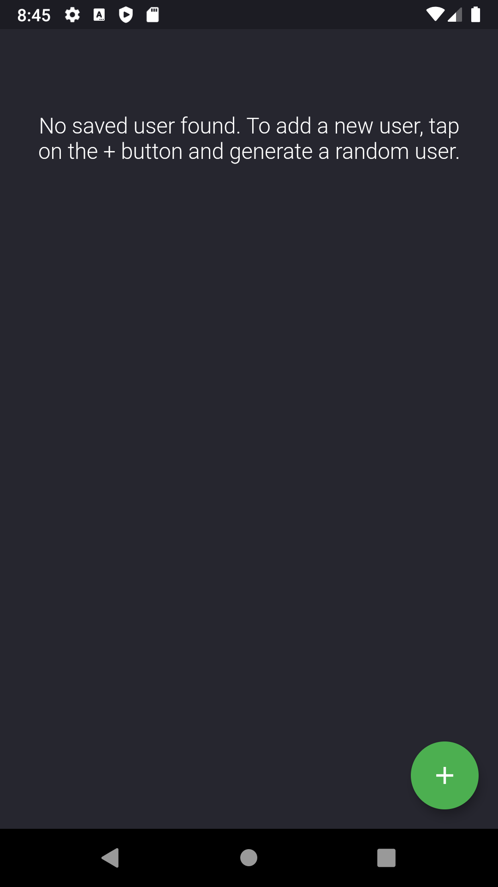
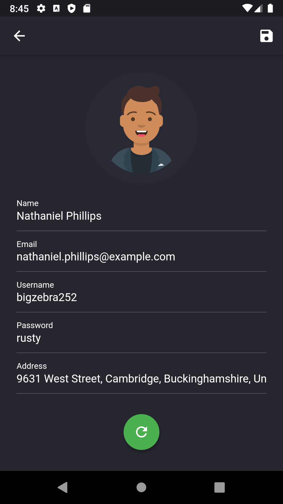
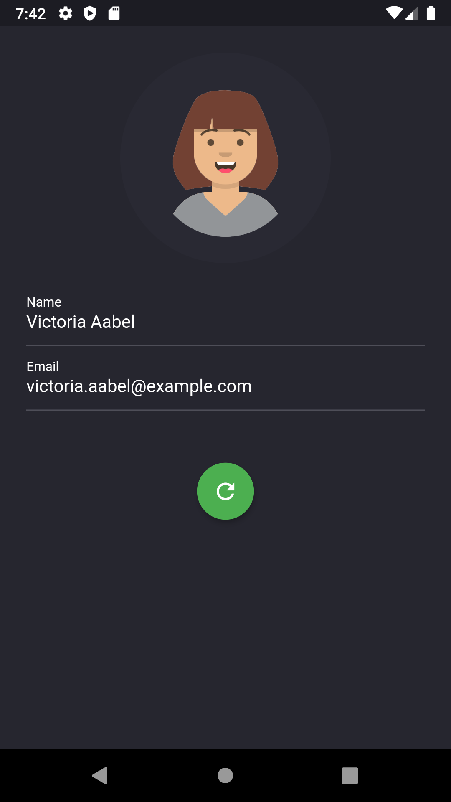
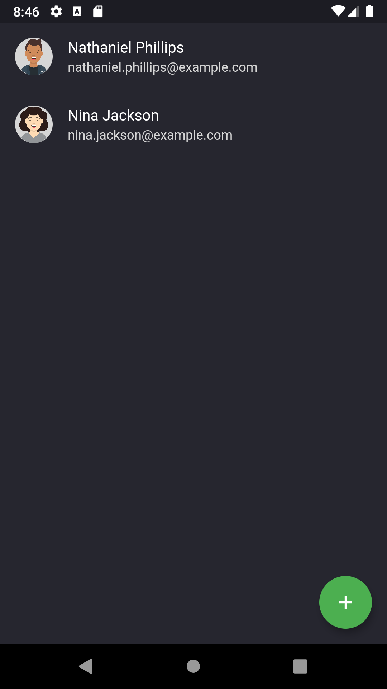
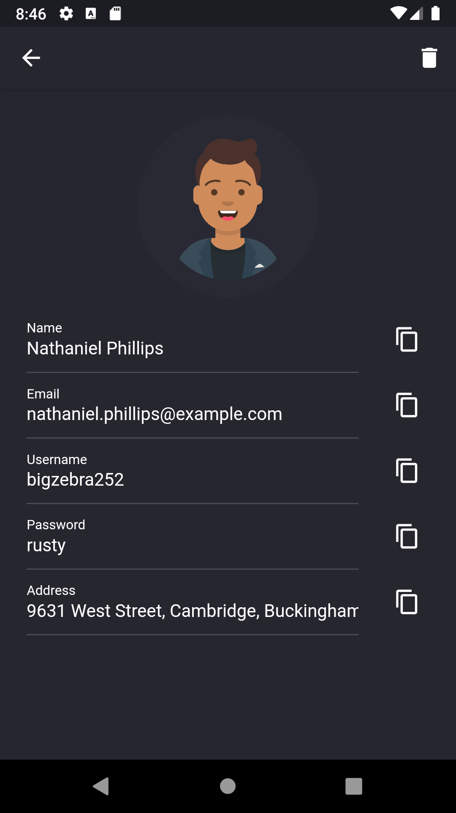

# Montage Flutter App


[](https://flutter.dev)

## About
Montage is a cross-platform mobile application built with Flutter that generates and save random user profiles that could be used to test out your application. The randomly generated information contain name, email, username, password and address. 

This is a sample project built with the randomuser.me API. It follows clean architecture principles and contains testing and a GitHub Actions CI pipeline. Libraries like BLoC, http and sqflite are also used.

</br>

## Screenshot






</br>

## Development
### Architecture
The project follows clean architecture and was implemented using test-driven development. It is divided into three layers: presentation, domain and data. Details regarding each layer can be found below:
```
lib
  - core (elements that are extensively used throughout the app)
  - features (structured divided amongst feature set)
    - random_user
      - data (layer that define how we get the data)
        - data_source (logic to obtain that data such as http request)
        - model (model or logic to parse the raw data)
        - repository (implementation that determines where to get the data)
      - domain (layer that defines business use case)
        - entity (data model used to drive the UI)
        - repository (abstract class definition of repository)
        - use_case (business use case contract between presentation and data)
      - presentation (layer that handles user action)
        - bloc (helper class for BLoC event and state)
        - page (widget that creates the scaffold and uses BLoC to determine which widget to display)
        - widget (any type of widget to display on the screen. e.g. text, button, list)
```

### Testing
The project was implemented using test-driven development and consists of both unit and widget tests. The following test include:
- BLoC testing
- Testing with mocks
- Testing HTTP request using JSON fixtures

Test files can be found in the test folder and follow the same project file structure as the source code. To run the following test, execute the commands in your terminal:
```
# run tests with coverage
$ flutter test --coverage

# Ignore some files from code coverage
$ lcov --remove coverage/lcov.info 'lib/injection_container.dart' 'lib/core/database/*' -o coverage/lcov.info

# Generate the code coverage report
$ genhtml coverage/lcov.info -o coverage/html
```

Currently, the code coverage is at:
```
Overall coverage rate:
  lines......: 94.3% (379 of 402 lines)
```

### CI Pipeline
GitHub Actions workflow is used as a CI pipeline to validate new changes to the project. On every push, the pipeline creates the `analyze` and `test` job which lints the dart code and tests out the project respectively. Ideally, the mainline should free of any lint issue, successfully pass all test and have a high test coverage.

</br>

## Roadmap
### 1.0 [Released]
- Users are able to generate and customize random user profiles
- Users are able to save their generated random user profile
- Saved users can be found on the initial user list screen
- Users can access their generated profile and copy content to their clipboard
- Users can delete saved user profile
