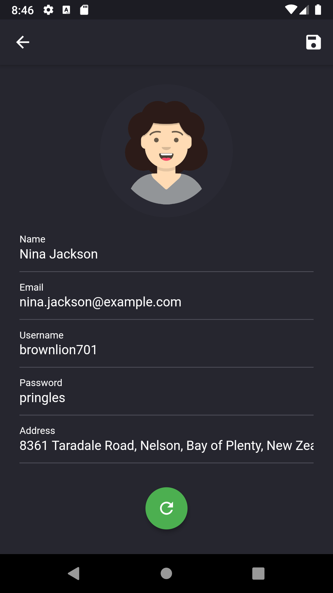

# Montage Flutter App

**Currently under development for production release**

##### Development
- Project is being developed using Clean Architecture with TDD
- Includes CI pipeline to analyze and test new changes

---

## About
Montage is a mobile application that creates and saves random user generated profiles that can used for testing your applications. The randomly generated information contains name, username, password, email and address.

 

## Screenshots

 

 

## Roadmap

### 1.0 [Planned]
- Users are able to generate and customize random user profiles
- Random user profiles can be saved and accessed through the user lists
